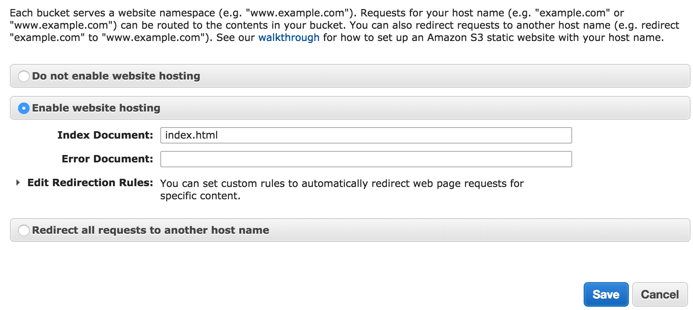
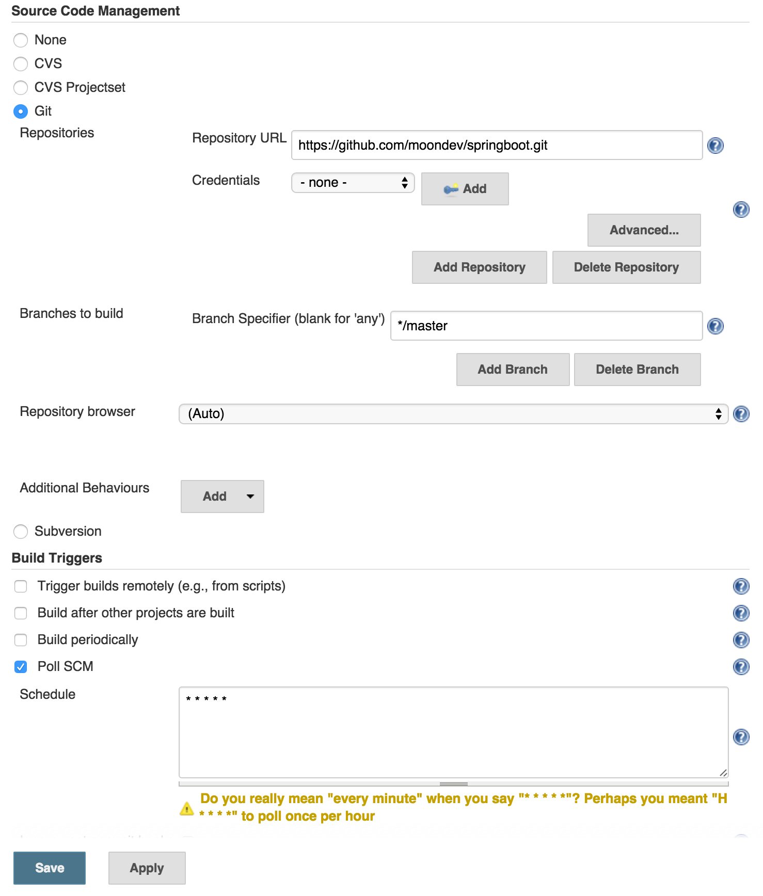
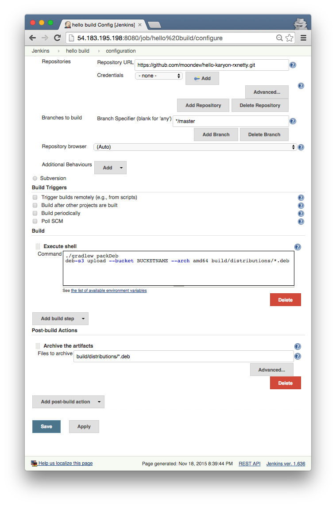

#An Introduction to Spinnaker: Hello Deployment

This guide will run through the workflow of setting up an example application deployment with [Spinnaker](http://spinnaker.io/). It assumes you already have Spinnaker up and running on AWS or GCE. A guide for installation can be found [here](http://spinnaker.io/documentation/getting_started.html).

Below is a diagram of the workflow we will setup.


##Setup Jenkins

Jenkins is a powerful continuous integration server that allows us to do several important things:

* Poll our Github repository for changes so Spinnaker knows when to run a pipeline.
* Compile and build our example application into .deb package so Spinnaker can bake it on an image. Spinnaker expects all applications to be deployed as deb packages.

###Installing Jenkins

If you already have a Jenkins server, you can skip this step. However be sure that port 9999 on the server is open to the internet, and that your Jenkins port is accessible by your Spinnaker instance.

Begin by launching a new Ubuntu Trusty image on your cloud, as mentioned above be sure that port 9999 is open and Jenkins port 8080 is accessible to you and your Spinnaker ip.

SSH into your instance and run the following:

```
# apt-get update
# apt-get upgrade
# apt-get install openjdk-7-jdk
# wget -q -O - https://jenkins-ci.org/debian/jenkins-ci.org.key | sudo apt-key add -
# sh -c 'echo deb http://pkg.jenkins-ci.org/debian binary/ > /etc/apt/sources.list.d/jenkins.list'
# apt-get update
# apt-get install jenkins
# service jenkins start
```

Visit port :8080 on your instance and you should see Jenkins startup and present the dashboard.

###Enable Jenkins API

Spinnaker communicates with Jenkins by using it's REST API. However the API is not enabled by default. To enable it we first must enable global security (which is a good idea anyway). Click "Manage Jenkins" then "Configure Global Security". Under Access Control check "Jenkins own database" and "allow users to sign up". Under authorization check "Logged-in users can do anything" and save.


You will now be presented with a login screen. Click the "Create an account" link to register. Take note of your username and password, Spinnaker will need them later. Now you can turn off allowing users to register as you can add them manually from the control panel. The Jenkins API is now enabled.

###Setup deb repo

There are several options you can use to setup your private deb repo. This involves leveraging a tool to create the file structure and format for your .deb packages and serving them on the internet so they can be installed.

#####deb-s3

[deb-s3](https://github.com/krobertson/deb-s3) is a ruby gem that allows you to create a publish your packages directly to an s3 bucket. The nice part about this is that you do not have to concern yourself with setting up ports or configuring a web server. S3 handles everything for us.

First create a new s3 bucket to hold your packages, take note of the name and region.

Next edit the properties of your bucket and turn on static website hosting.



We will now install deb-s3 on our Jenkins server.

First install Ruby and bundler (here we will use rvm):

```
sudo apt-get update
sudo apt-get install git-core curl zlib1g-dev build-essential libssl-dev libreadline-dev libyaml-dev libsqlite3-dev sqlite3 libxml2-dev libxslt1-dev libcurl4-openssl-dev libgdbm-dev libncurses5-dev automake libtool bison libffi-dev python-software-properties libffi-dev
curl -L https://get.rvm.io | bash -s stable
source ~/.rvm/scripts/rvm
rvm install 2.2.3
rvm use 2.2.3 --default
ruby -v
echo "gem: --no-ri --no-rdoc" > ~/.gemrc
gem install bundler
```

now install the deb-s3 gem
```
gem install deb-s3
```
The address of your repo will now be `http://BUCKET-NAME.s3-website-REGION-NAME.amazonaws.com trusty main`


####Aptly

[Aptly](http://www.aptly.info/) is a tool that easily allows us to manage and publish the packages to the local filesystem. After we install and configure the tool, nginx will host the repository on our jenkins server so it can be consumed during the bake process. Since nginx will run on port 9999 it is important that this port on your Jenkins server will be accessible from the internet.

The following will install aptly to the jenkins user home directory so our jobs can easily use it. We will also create our repo so the jobs can easily add packages.

```
$ cd ~
$ wget https://dl.bintray.com/smira/aptly/0.9.5/debian-squeeze-x64/aptly
$ chmod +x aptly
```

Create our repo named "hello"

```
$ ./aptly repo create hello
```

We will now publish our (currently empty) repo and setup nginx to host it on port 9999.

```
# ./aptly publish repo -architectures="amd64" -component=main -distribution=trusty -skip-signing=true hello
```
###Setup Nginx to serve deb repo
Install and configure nginx

```
# apt-get install nginx
# vim /etc/nginx/sites-enabled/default
```

Contents of /etc/nginx/sites-enabled/default:

```
server {
        listen 9999 default_server;
        listen [::]:9999 default_server ipv6only=on;
        root home/ubuntu/.aptly/public;
        index index.html index.htm;
        server_name localhost;
        location / {
                try_files $uri $uri/ =404;
        }
}
```

Start nginx `service nginx start`

the address of the repo will be `http://JENKINS-SERVER:9999 trusty main`

###Fork example application

We have set up an example application with a gradle.build ready to package your app for spinnaker deployment. Fork [https://github.com/kenzanlabs/hello-karyon-rxnetty](https://github.com/kenzanlabs/hello-karyon-rxnetty) via the github UI so you can make changes and see them flow through the Spinnaker pipeline.

###Create Jenkins Jobs

We will now setup our 4 jenkins jobs for spinnaker to use.

1. Polling Job

The first is a simple job that polls our git repo for changes. Spinnaker has no knowledge of our repo location, so it needs a way to trigger a pipeline automatically when code is pushed. (A pipeline is a set of actions that handle the application delivery) Spinnaker will poll our polling job and kick off a pipeline when it detects a fresh run.

* Ensure the Jenkins git plugin is enabled and create a new Freesyle Project named "Hello Poll".
* Add your app fork git address.
* Under build triggers check "Poll SCM" and enter `* * * * *` for Jenkins to poll once a minute. You can now save the job.



2. Build Job

This job will be responsible for building a publishing our package, along with passing the package and version name to Spinnaker.

* Create a new freestyle job named "Hello Build".
* Add the git url for your application fork
* Add a build step for "execute shell"
* In the textbox execute the packDeb task `./gradlew packDeb`
* If you used deb-s3 for your repo, add the following: `deb-s3 upload --bucket BUCKETNAME --arch amd64 --codename trusty --preserve-versions true build/distributions/*.deb`
* If you used aptly for your repo, add the following: `~/aptly repo add hello build/distributions/*.deb && ./aptly publish repo -architectures="amd64" -component=main -distribution=trusty -skip-signing=true hello`



##Configure Spinnaker

SSH to your Spinnaker instance by tunneling the needed ports. Tunneling ensures that Spinnaker is not accessible from the internet outside of your ssh connection. This is **very important** because anyone who has access to Spinnaker can do anything your cloud account can do.

The ports needed:

* 9000: html/js UI (Deck)
* 8084: API entrypoint (Gate)
* 8087: Image bakery (Rosco)

```
ssh -i yourkey.pem -L 9000:127.0.0.1:9000 -L 8084:127.0.0.1:8084 -L 8087:127.0.0.1:8087 ubuntu@instanceip
```

Spinnaker will be accessible on [http://localhost:9000](http://localhost:9000).

###Jenkins Integration

Before we can begin setting up our workflow, we need to edit the Spinnaker configuration to allow it to communicate with our Jenkins server.

Begin by shutting down Spinnaker. Spinnaker configuration is stored in memory so we need to reload it every time we make a change. You can now edit the master configuration file:

```
# stop spinnaker
# vim /opt/spinnaker/config/spinnaker-local.yml
```

Scroll down to jenkins section and add your url, username and password from above

```
  jenkins:
    defaultMaster:
      name: Jenkins # The display name for this server
      baseUrl: http://jenkins-server:8080
      username: jenkinsuser
      password: jenkinspassword
```

You also need to enable igor, the service that communicates with the jenkins api.

```
igor:
    enabled: true
```

###Deb Repository

The last configuration step is to add our deb repository address to the Rosco config. When Spinnaker is baking the application image, it will add this address to the sources list so it can `apt-get install` the deb package. For this reason it is important that port 9000 is open on our Jenkins server which hosts the repo.

```
# vim /opt/rosco/config/rosco.yml
```
Add your repo address from above. For example if we used deb-s3:

```
debianRepository: http://BUCKET-NAME.s3-website-REGION-NAME.amazonaws.com trusty main
```
We can now start Spinnaker and start configuring our workflow. `# start spinnaker`

##Create Spinnaker application

The concept of an application allows us to group our resources and pipelines in a logical way. This makes it easy to manage our app in a single place instead of searching for items buried in menus.

* Visit http://localhost:9000 and click the actions button -> create application.
* Fill out the information, naming it "hello" and click save. We are now ready to add resources to our app.


* Create security group
* Create load balancer

##Setup Spinnaker Pipeline

Our pipeline is triggered by polling our Jenkins server to see if our code has updated. We then create two stages

* Run jenkins job to build our application
* Perform bake on build artifact (deb package)
* Deploy our baked image to cluster
