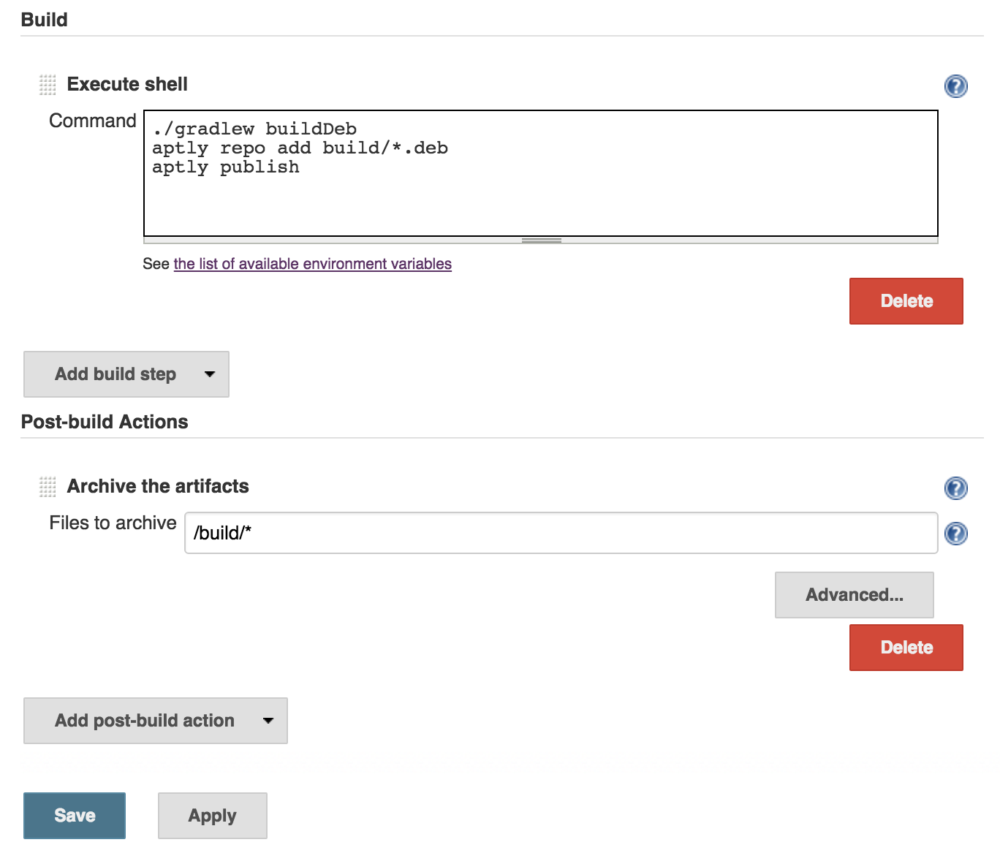

#An introduction to Spinnaker: Hello World

Spinnaker is an IaaS tool from Netflix that manages deployment of applications in the cloud. While many tools and consoles exist to solve this problem, they are not specialized to group and manage the entire lifecycle from code push to deployment. Many parts of the process are abstracted away by Jenkins and other systems. Spinnaker addresses this by introducing the organization concept of applications, stacks, details and pipelines to easily view and manage the process from start to finish. These are linked to cloud resources on the IaaS platform. 


###Below is a diagram of the workflow we will setup for an example deployment.


##Spinnaker archetecture and installation.

Spinnaker is designed in a microservice archetecture. The application itself is a collection of several focused packages that can be run on a single instance or distributed amongst multiple. Here is a summary of each service and what they do:

* Clouddriver - Read and write operations across cloud providers
* Front50 - Persistence service to store application metadata
* Orca - Orchestration service
* Echo - Event reciever and dispatcher
* Rosco - Bakes application into cloud images via docker
* Rush - Executes scripts inside docker images (Rosco)
* Igor - Integration with Jenkins
* Deck - html/js front-end

For the sake of a quick-start, you can install spinnaker as a micronolith with all needed services on one machine. Keep in mind that a healthy memory requirement is needed. m4.2xlarge (Amazon) or n1-standard-8 (Google) are recommended for those platforms. You will also need a Jenkins server setup. When configuring Spinnaker it will ask you for the Jenkins url, admin username and password. There is also a terraform component that can set up a vpc and other necessary infrastructure components.

```
$ wget https://gist.githubusercontent.com/moondev/4667b2784e384680fdb2/raw/dcd937bb6db78699568e3d6debc7986c08251d03/kenspin.sh && chmod +x kenspin.sh && sudo ./kenspin.sh
```

##Example application

You can fork our example application here: https://github.com/kenzanmedia/hello-karyon-rxnetty It is a simple Spring Boot web application that displays the instance-id it is running on. It is already setup to build a debian package to be baked on a base ami. Spinnaker requires your application to produce a .deb artifact.

##Setup Jenkins Jobs and Aptly

Aptly is a package used to publish .deb packages locally. We will install this on our Jenkins server for simplicity.

There are two jenkins jobs that need to be created for our example workflow. 

The first is a simple job that polls our git repo for changes. Spinnaker has no knowledge of our repo location, so it needs a way to trigger a pipleline automatically when code is pushed. (A pipeline is a set of actions that handle the application delivery) Spinnaker will poll our polling job and kick off a pipeline when it detects a fresh run.

* Ensure the Jenkins git plugin is enabled and create a new Freesyle Project named "Example Poll Github".


* Add your forked repo (and credentials if your fork is private). 
* Under build triggers check "Poll SCM" and enter "* * * * *" for Jenkins to poll once a minute. You can now save the job.


Our next jenkins job will build our application. Spinnaker expects our applications to be .deb packages. The package will handle installation and automatic startup of the app on a vanilla Ubuntu Trusty instance. Our example app is already setup to generate a .deb artifact with the ./gradlew buildDeb command.

* Duplicate your "Example Poll SCM" job and name it "Example Build"
* Uncheck "Poll SCM". Spinnaker will launch this job for us from our pipeline we will create.
* Add an "execute shell" build step for building and publishing debs.
* Add a post-build action to archive the artifacts. In the "files to archive" field type "/build/*". This ensures that the .deb artifact is available to spinnaker for the next step.
* 

##Setup Spinnaker Application

The concept of an application allows us to group our resources and pipelines in a logical way. This makes it easy to manage our app in a single place instead of searching for items buried in menus.

* Create application
* Create security group
* Create load balancer

##Setup Spinnaker Pipeline 

Our pipeline is triggered by polling our Jenkins server to see if our code has updated. We then create two stages 

* Run jenkins job to build our application
* Perform bake on build artifact (deb package)
* Deploy our baked image to cluster

##Test Deployment

Once we have the above steps complete, it's time to test our workflow. 

* Make a change to your forked app and push to github. 
* Observe Jenkins polling job run once it detects changes
* Observe Spinnaker kick off pipeline once it detects polling job has run
* Observe first pipleline stage run jenkins job to build app into debian package
* Observe second pipleline stage begin baking image with docker/packer
* Observe third pipeline stage run and deploy our application into a cluster
* View your deployed application. Make another change and observe process
